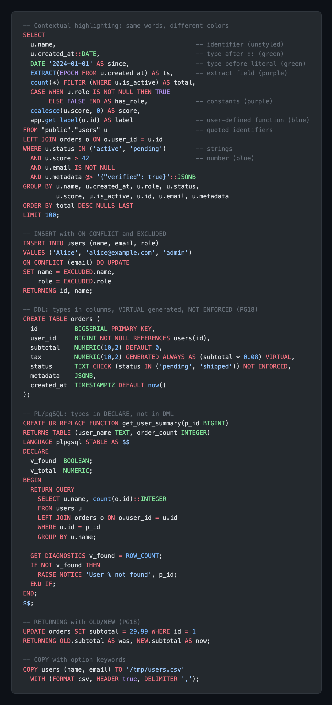

# pgsql-grammar

[](https://github.com/vabatta/pgsql-grammar/actions/workflows/ci.yml)

Just a complete and colorful PG18 TextMate grammar.

Standalone `pgsql.tmLanguage.json` targeting Shiki, VS Code, GitHub Linguist, and anything that supports TextMate grammars.



## Highlighting

Reference theme: **github-dark**

| Token | Context | Color | Example |
|-------|---------|-------|---------|
| Keywords | everywhere | red | `SELECT`, `FROM`, `WHERE`, `AND`, `JOIN`, `CREATE TABLE`, `BEGIN`, `END` |
| Operators | everywhere | red | `::`, `=`, `<>`, `\|\|`, `@>`, `->>` |
| Built-in functions | before `(` | blue | `now()`, `count(*)`, `coalesce(a, b)` |
| User-defined functions | before `(` | blue | `get_active_users(100)`, `app.my_func()` |
| Numbers | everywhere | blue | `42`, `3.14` |
| Built-in types | after `::` | green | `x::DATE`, `y::INTEGER` |
| Built-in types | inside `CAST` | green | `CAST(y AS NUMERIC)` |
| Built-in types | before literal | green | `INTERVAL '1 day'`, `DATE '2024-01-01'` |
| Built-in types | DDL columns | green | `CREATE TABLE t (id SERIAL, name TEXT)` |
| Built-in types | function signatures | green | `CREATE FUNCTION f(p_id BIGINT)` |
| Built-in types | PL/pgSQL `DECLARE` | green | `DECLARE v_count INTEGER;` |
| Built-in types | DML (bare word) | unstyled | `SELECT date, name, text FROM t` |
| Constants | everywhere | purple | `NULL`, `TRUE`, `FALSE` |
| `EXTRACT` fields | inside `EXTRACT()` | purple | `EXTRACT(EPOCH FROM now())` |
| Single-quoted strings | everywhere | light blue | `'hello'`, `E'\n'` |
| Double-quoted identifiers | everywhere | light blue | `"my_table"."column"` |
| Comments | everywhere | grey | `-- line`, `/* block */` |
| Identifiers | DML | unstyled | `u.name`, `created_at`, `users` |
| Table after `INTO`/`COPY` | before `(columns)` | unstyled | `INSERT INTO users (name)`, `COPY t (col)` |
| Table after `ON`/`REFERENCES` | before `(columns)` | unstyled | `ON orders (user_id)`, `REFERENCES t(id)` |

## Coverage

- 300+ keywords (DML, DDL, PL/pgSQL, utility)
- 100+ PostgreSQL type names with multi-word support
- 200+ built-in functions and support constants
- Standalone keyword fallbacks for multiline resilience
- 415 test assertions across 20 test files

## Usage

```bash
npm test               # run 415 grammar tests
npm run validate       # 0 unscoped tokens across all samples
npm run validate-sql   # all statements parse via libpg-query
npm run preview        # http://localhost:3117 — live preview with theme picker
```

## Nix

```nix
# As a flake input
inputs.pgsql-grammar.url = "github:vabatta/pgsql-grammar";

# Get the grammar file
pgsql-grammar.packages.${system}.default
# → $out/pgsql.tmLanguage.json
```

## Versioning

Major version tracks PostgreSQL (`18.x.y` → PG18). Minor and patch are grammar improvements. PG minor releases (18.1, 18.2) never change SQL syntax, so the version space is entirely ours.

## License

MIT
